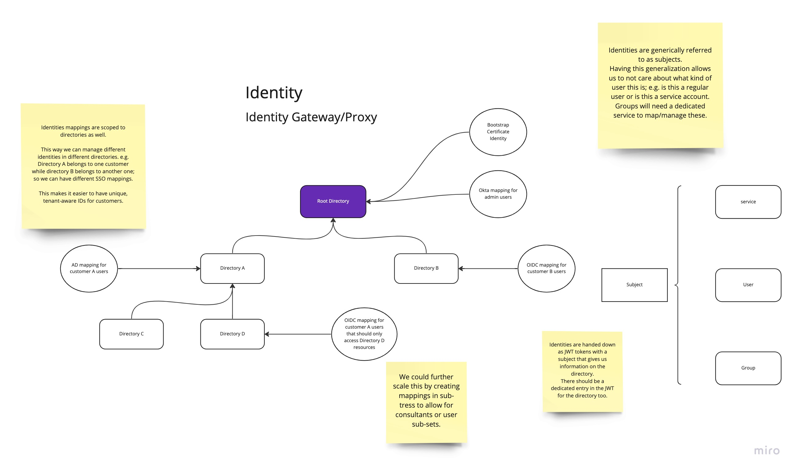
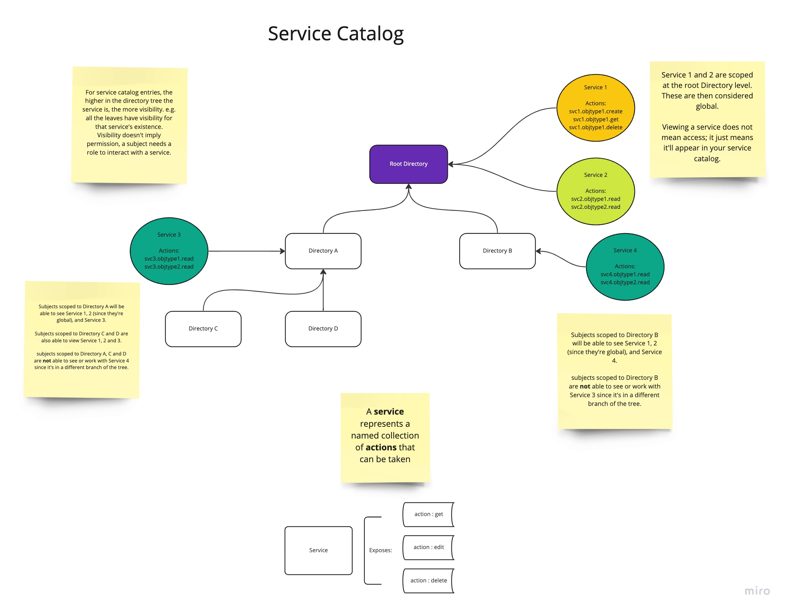

Applications
============

Normally, applications are to abide by the following rules:

- They must scope their resources to a specific node in the tree.
- They must not assume that a resource is global.
- They must not modify the tree in any way.
- They must not modify the tree manager in any way.
- They must not modify the storage system in any way.
- They must not assume that the tree manager is running on the same machine.

The tree manager provides the APIs to access the tree, and the applications are
expected to use that to determine what to do.

All components of the platform are merely considered as applications.

Identity
--------

The tree manager does not provide any notion of identity. In a general sense,
it is expected that the applications that use the tree manager will provide their 
own identity management. However, identities are needed for any platform, and thus
the intent is to build an application that can easily provide usable identities to
Infratographer services.

The tree manager provide a way to associate an
identity with a node in the tree. For this, an application will be built
that will associate an identity mapping with a node in the tree.

By associating an identity with a node in the tree, we can provide a way to
further segment tenants. For example, if we have a tenant that has multiple
departments, we can create a node for each department and associate an identity
with each node. This will help us segment the view of the tree for each
sub-tenant and allow for use-cases such as a re-seller and consultants.

In the current view, we think it's best not to deal with identity management and
instead natively rely on users bringing their own. However, to unify the
platform and allow users into the system, we can follow a federated approach and
map tokens coming from upstream identity providers to an approved downstream
identity that we can trust and is scoped to a node in the tree. The idea is to follow
RFC 8693 (OAuth 2.0 Token Exchange) [[1](https://www.rfc-editor.org/rfc/rfc8693.html)],
in order to allow for a token exchange between the upstream identity provider and
the node-scoped platform identity.

To follow the work, see [the DMV project](https://github.com/infratographer/dmv) [[2](https://github.com/infratographer/dmv)]. The goal is to get a uniform identity
that can be used to access Infratographer services, and that we can use to get
information such as who did an action and what's the scope in the tree.

Service Catalog
---------------

In order to provide a way to discover services, we can use the tree manager to
power a service catalog. The service catalog will rely on nodes in the tree that
will contain a list of services that are available to the tenant.

The notion of visibility in the service catalog already relies on having a
uniform identity that's scoped to a node in the tree. This is because the
service catalog will be used to discover services that are available to the
tenant, and thus the tenant will need to be able to provide a token that
represents the tenant.

The service catalog will be a service that will be built on top of the tree
manager. It will be a service that will be able to discover services that are
available to the tenant, and will be able to provide a way to access those
services.

A service catalog project is not yet started. Feel free to start one!

Authorization
-------------

Having a service catalog is great, but it's not enough. We need to be able to
authorize users to access services. This is where the unified identity + directory
scoping comes in. We can use the identity to determine what services are available
to the user, and then use the directory scoping to determine what the user can
access in the tree. Finally, we can have a role based access control (RBAC)
system that will determine what the user can do in the service.

Roles, like everything in the system, are scoped to a node in the tree. This
allows for inheritance of roles, and allows for a more granular control of
access.

Access control should work as an allow-list, that is even if a user's identity
is scoped to a node in the tree, they will not be able to access the service
unless they have a role that allows them to do so.

The authorization system project is not yet started. Feel free to start one!

References
----------

[1] https://www.rfc-editor.org/rfc/rfc8693.html

[2] https://github.com/infratographer/dmv